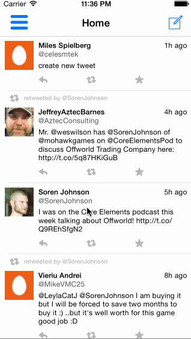

## Twitter Redux

This is a basic twitter app to read and compose tweets the [Twitter API](https://apps.twitter.com/).

Time spent: `13`

### Features

#### Required

- [x] Hamburger menu
  - [x] Dragging anywhere in the view should reveal the menu.
  - [x] The menu should include links to your profile, the home timeline, and the mentions view.
- [x] Profile page
  - [x] Contains the user header view.
  - [x] Contains a section with the user's basic stats: # tweets, # following, # followers.
- [x] Home Timeline
  - [x] Tapping on a user image should bring up that user's profile page.

#### Optional

(no optional items)

#### Extra
- [x] Hamburger menu
  - [x] Menu item handling is in a separate view controller from the overlay/underlay handling.
  - [x] Dragging is bounded.
  - [x] Navigation bars contain buttons to show/hide the menu.
  - [x] Tapping a menu item for a timeline pops any currently displayed detail views.
- [x] Profile page
  - [x] summoned by tapping user names and screennames, as well as within the tweet detail view.

### Walkthrough

